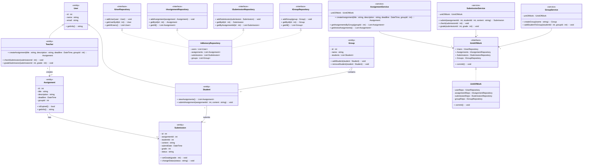

```mermaid
classDiagram

%% =========================
%%        MODELS (ENTITIES)
%% =========================

class User {
    <<entity>>
    - id : int
    - name : string
    - email : string
    + getInfo() : string
}

class Student {
    <<entity>>
    + viewAssignments() : List~Assignment~
    + submitAssignment(assignmentId : int, content : string) : void
}

class Teacher {
    <<entity>>
    + createAssignment(title : string, description : string, deadline : DateTime, groupId : int) : Assignment
    + checkSubmission(submissionId : int) : void
    + gradeSubmission(submissionId : int, grade : int) : void
}

class Assignment {
    <<entity>>
    - id : int
    - title : string
    - description : string
    - deadline : DateTime
    - groupId : int
    + isExpired() : bool
    + getInfo() : string
}

class Submission {
    <<entity>>
    - id : int
    - assignmentId : int
    - studentId : int
    - content : string
    - submitDate : DateTime
    - grade : int
    - status : string
    + setGrade(grade : int) : void
    + changeStatus(status : string) : void
}

class Group {
    <<entity>>
    - id : int
    - name : string
    - students : List~Student~
    + addStudent(student : Student) : void
    + removeStudent(student : Student) : void
}

%% =========================
%%     REPOSITORIES
%% =========================

class IUserRepository {
    <<interface>>
    + addUser(user : User) : void
    + getUserById(id : int) : User
    + getAllUsers() : List~User~
}

class IAssignmentRepository {
    <<interface>>
    + addAssignment(assignment : Assignment) : void
    + getById(id : int) : Assignment
    + getAll() : List~Assignment~
}

class ISubmissionRepository {
    <<interface>>
    + addSubmission(submission : Submission) : void
    + getById(id : int) : Submission
    + getByAssignmentId(id : int) : List~Submission~
}

class IGroupRepository {
    <<interface>>
    + addGroup(group : Group) : void
    + getById(id : int) : Group
    + getAll() : List~Group~
}

class InMemoryRepository {
    - users : List~User~
    - assignments : List~Assignment~
    - submissions : List~Submission~
    - groups : List~Group~
}

%% =========================
%%      UNIT OF WORK
%% =========================

class IUnitOfWork {
    <<interface>>
    + Users : IUserRepository
    + Assignments : IAssignmentRepository
    + Submissions : ISubmissionRepository
    + Groups : IGroupRepository
    + commit() : void
}

class UnitOfWork {
    - userRepo : IUserRepository
    - assignmentRepo : IAssignmentRepository
    - submissionRepo : ISubmissionRepository
    - groupRepo : IGroupRepository
    + commit() : void
}

%% =========================
%%        SERVICES
%% =========================

class AssignmentService {
    <<service>>
    - unitOfWork : IUnitOfWork
    + createAssignment(title : string, description : string, deadline : DateTime, groupId : int) : Assignment
    + getAssignmentsByGroup(groupId : int) : List~Assignment~
    + getActiveAssignments() : List~Assignment~
}

class SubmissionService {
    <<service>>
    - unitOfWork : IUnitOfWork
    + submit(assignmentId : int, studentId : int, content : string) : Submission
    + check(submissionId : int) : void
    + grade(submissionId : int, grade : int) : void
}

class GroupService {
    <<service>>
    - unitOfWork : IUnitOfWork
    + createGroup(name : string) : Group
    + addStudentToGroup(studentId : int, groupId : int) : void
}

%% =========================
%%     RELATIONSHIPS
%% =========================

User <|-- Student
User <|-- Teacher

Teacher "1" --> "0..*" Assignment : creates
Assignment "1" --> "0..*" Submission : has
Student "1" --> "0..*" Submission : submits

Group "1" o-- "0..*" Student : contains

AssignmentService --> "1" IUnitOfWork
SubmissionService --> "1" IUnitOfWork
GroupService --> "1" IUnitOfWork

IUserRepository <|.. InMemoryRepository
IAssignmentRepository <|.. InMemoryRepository
ISubmissionRepository <|.. InMemoryRepository
IGroupRepository <|.. InMemoryRepository

IUnitOfWork <|.. UnitOfWork
```